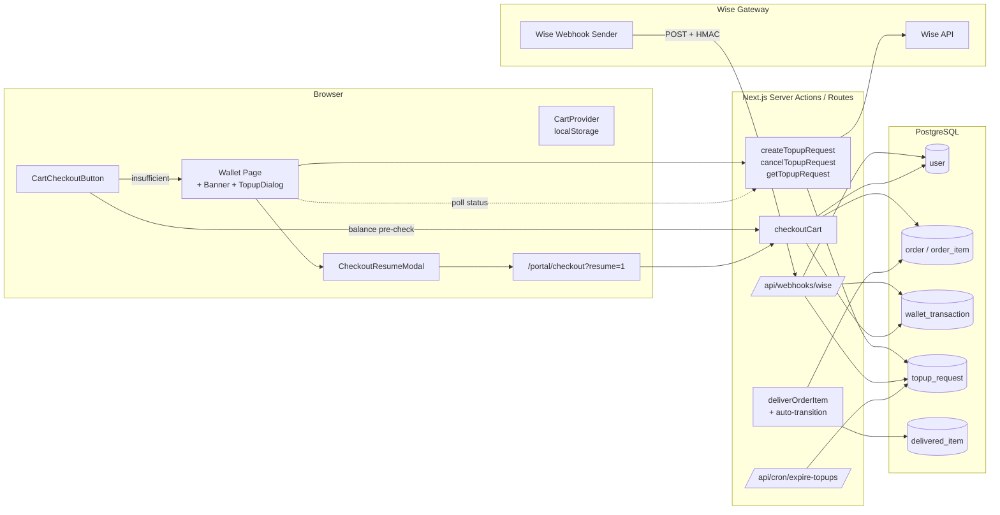
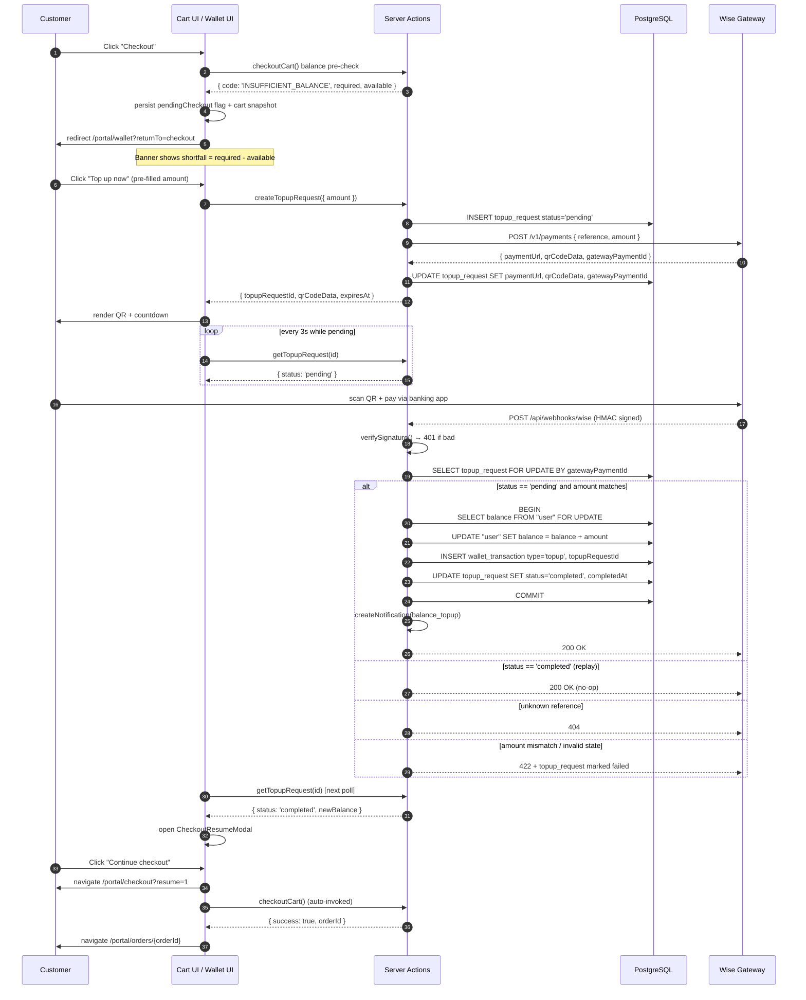
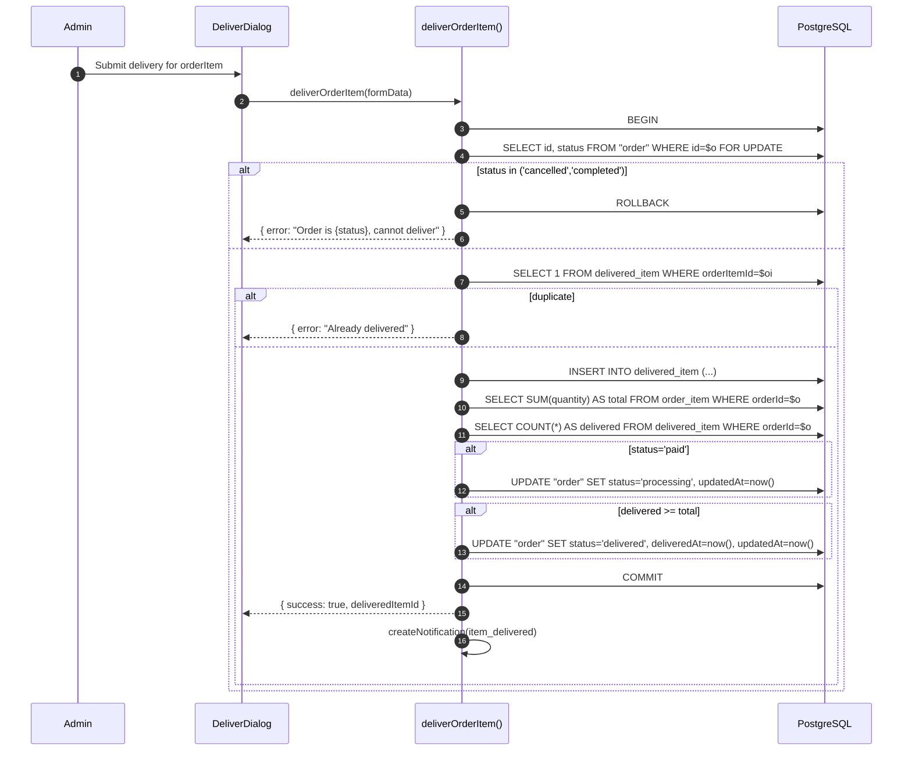
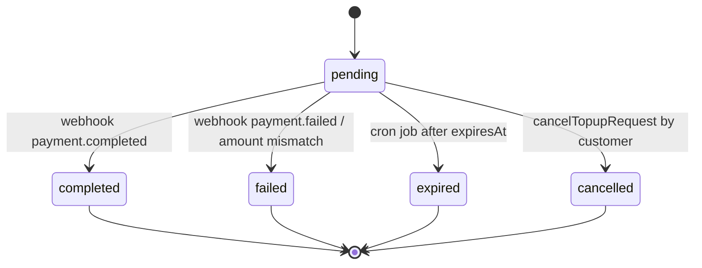
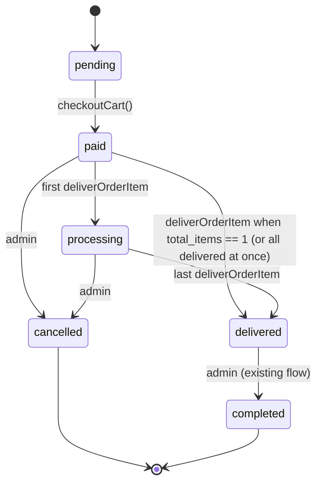

# Design Document — Cart Checkout with Wallet Top-Up

## Overview

This feature closes the gap between the current customer portal (browse + add to cart) and admin-driven order creation. After this work ships, an authenticated customer can:

1. Click **Checkout** in the portal cart. The portal does a server-authoritative balance pre-check.
2. If short on funds, get redirected to `/portal/wallet?returnTo=checkout` with a destructive banner showing the exact shortfall, and open a top-up dialog pre-filled with that amount.
3. Pay via Wise by scanning a QR code. The dialog polls a `topup_request` row and reacts when a Wise webhook flips it to `completed`.
4. Get prompted with a "Continue checkout" modal as soon as the top-up clears, which navigates to `/portal/checkout?resume=1` and auto-invokes `checkoutCart()`.
5. Land on `/portal/orders/{orderId}` with cart and pending-checkout state cleared.

In parallel, the admin delivery flow (`deliverOrderItem()`) is patched so an order auto-transitions `paid` → `processing` on the first delivered line and `processing` → `delivered` once the last unit is delivered, removing manual status management.

### Goals

- Server-authoritative pricing and balance: client-supplied prices are ignored, balance is read inside a `FOR UPDATE`-locked transaction.
- Atomic checkout: one server action produces (or rolls back) `order` + N `order_item` + 1 `wallet_transaction(deduct)`.
- Idempotent top-up: replaying the same Wise webhook never double-credits.
- Resume-aware UX: cart is preserved across the topup detour; the resume modal removes the "now what?" moment after payment clears.
- Layered, file-level deliverable: design + tasks are organized so DB / BE / FE / Integration work can be tracked and parallelized.

### Non-Goals

- Multi-currency support (currency is fixed to `USD`; the column exists for future use).
- Refunds or partial top-ups via the portal (admins still handle these via existing tools).
- Replacing the marketing-side `CartPopover` Telegram order flow. That stays for unauthenticated visitors; the new checkout button only appears for authenticated `customer` sessions.
- A full payment-provider abstraction. The integration layer is shaped so a second provider could be slotted in, but only Wise ships in this spec.

## Architecture

### High-level data flow



### Layers

- **Database Layer** — schema for `topup_request`, new enum, FK on `wallet_transaction`, a `Total_Items` helper, and a single Drizzle migration.
- **Backend Layer** — Zod schemas, `checkoutCart()`, `createTopupRequest()` / `cancelTopupRequest()` / `getTopupRequest()`, modified `deliverOrderItem()`, query helpers.
- **Frontend Layer** — checkout button, wallet banner, top-up dialog, resume modal, checkout landing page, status-polling hook, cart-context owner-id.
- **Integration Layer** — Wise client + types + signature verifier, webhook route, scheduled job for expiring `pending` rows.

## Sequence Diagrams

### 1. Successful checkout (sufficient balance)

```mermaid
sequenceDiagram
    autonumber
    participant U as Customer
    participant FE as Cart UI
    participant Btn as CartCheckoutButton
    participant SA as checkoutCart()
    participant DB as PostgreSQL

    U->>FE: Click "Checkout"
    Btn->>SA: checkoutCart({ items })
    SA->>DB: BEGIN<br/>SELECT balance FROM "user" WHERE id=$cust FOR UPDATE
    SA->>DB: SELECT * FROM product WHERE id IN (...)
    SA->>DB: SELECT * FROM customer_price WHERE customerId=$cust AND productId IN (...)
    Note over SA: total = SUM(resolved_price * quantity)
    alt balance >= total
        SA->>DB: UPDATE "user" SET balance = balance - total
        SA->>DB: INSERT INTO "order" (status='paid', paymentDate=now())
        SA->>DB: INSERT INTO order_item (...)
        SA->>DB: INSERT INTO wallet_transaction (type='deduct', balanceAfter)
        SA->>DB: COMMIT
        SA-->>Btn: { success: true, orderId }
        SA->>SA: createNotification(order_created)  [non-blocking]
        Btn->>FE: clearCart() + clearPendingFlag()
        FE->>U: navigate /portal/orders/{orderId}
    else balance < total
        SA->>DB: ROLLBACK
        SA-->>Btn: { success: false, code: 'INSUFFICIENT_BALANCE', required, available }
        Btn->>FE: setPendingCheckoutFlag(); navigate /portal/wallet?returnTo=checkout
    end
```

### 2. Checkout with insufficient balance → top-up → resume



### 3. Admin delivery auto-status transitions



## Components and Interfaces

This section enumerates every new and modified module by layer. Each entry lists file path, public API, inputs/outputs, side effects, and error cases. Later sections (Error Handling, Testing Strategy) cross-reference these.

### Database Layer

#### `topup_request_status` enum

- **File**: `src/lib/db/schema/enums.ts`
- **Definition**: `pgEnum("topup_request_status", ["pending","completed","failed","expired","cancelled"])`
- **Used by**: `topup_request.status`

#### `topup_request` table

- **File**: `src/lib/db/schema/wallet-tables.ts` (co-located with `wallet_transaction` since they are tightly coupled)
- **Drizzle definition**:

```ts
export const topupRequests = pgTable(
  "topup_request",
  {
    id: text("id").primaryKey(),
    customerId: text("customerId")
      .notNull()
      .references(() => users.id, { onDelete: "cascade" }),
    amount: numeric("amount", { precision: 12, scale: 2 }).notNull(),
    currency: text("currency").notNull().default("USD"),
    status: topupRequestStatusEnum("status").notNull().default("pending"),
    reference: text("reference").notNull().unique(),
    gatewayPaymentId: text("gatewayPaymentId"),
    paymentUrl: text("paymentUrl"),
    qrCodeData: text("qrCodeData"),
    expiresAt: timestamp("expiresAt").notNull(),
    completedAt: timestamp("completedAt"),
    failureReason: text("failureReason"),
    createdAt: timestamp("createdAt").notNull().defaultNow(),
    updatedAt: timestamp("updatedAt").notNull().defaultNow(),
  },
  (table) => [
    index("topup_request_customer_status_idx").on(table.customerId, table.status),
    index("topup_request_gateway_idx").on(table.gatewayPaymentId),
  ],
);
```

- **Indexes**:
  - `unique` on `reference` (auto via column constraint).
  - `(customerId, status)` for "show my pending top-ups" queries.
  - `gatewayPaymentId` for webhook lookup.
- **Side effects**: none (pure schema).

#### Modification: `wallet_transaction.topupRequestId`

- **File**: `src/lib/db/schema/wallet-tables.ts`
- **Change**: add `topupRequestId: text("topupRequestId").references(() => topupRequests.id)` (nullable, no cascade — we don't want a deleted topup row to delete the transaction record).
- **Rationale**: see Open Questions Resolution #2. Typed FK is queryable, type-safe, and self-documenting; the existing `note` column stays for human-readable annotations.

#### Modification: `createdBy` on `wallet_transaction`

- **Issue**: today `createdBy` is `notNull` and references `user.id`. For webhook-driven top-ups there is no admin user. We have two choices:
  - (A) Make `createdBy` nullable. Drift from the existing assumption that someone is responsible.
  - (B) Use the customer themselves as `createdBy` for webhook top-ups (the customer initiated the top-up).
- **Decision**: (B) — set `createdBy = customerId` for webhook top-ups, matching the semantics "the customer caused this transaction". No schema change needed.

#### `Total_Items` helper

- **File**: `src/lib/db/queries/order-queries.ts`
- **Public API**:
  ```ts
  export async function getOrderTotalQuantity(
    tx: TxOrDb,
    orderId: string,
  ): Promise<number>;
  ```
- **Behavior**: `SELECT COALESCE(SUM(quantity), 0) FROM order_item WHERE orderId = $1`. Always run inside the same transaction as the delivery write.
- **Resolves Open Question #1** — we use `SUM(quantity)`, not `COUNT(*)`. The current `deliverOrderItem()` code is incorrect for any order line with `quantity > 1`.
- **Side effects**: none (read-only).
- **Errors**: none — empty result returns 0.

#### Drizzle migration

- **Path**: `drizzle/<timestamp>_topup_requests.sql`
- **Generation**: `pnpm db:generate` after adding the schema.
- **Order of statements**:
  1. `CREATE TYPE topup_request_status AS ENUM (...)`
  2. `CREATE TABLE topup_request (...)`
  3. `CREATE UNIQUE INDEX topup_request_reference_unique ON topup_request(reference)` (auto)
  4. `CREATE INDEX topup_request_customer_status_idx ON topup_request(customerId, status)`
  5. `CREATE INDEX topup_request_gateway_idx ON topup_request(gatewayPaymentId)`
  6. `ALTER TABLE wallet_transaction ADD COLUMN "topupRequestId" text REFERENCES topup_request(id)`
- **Rollback considerations**: drop in reverse order; the FK on `wallet_transaction` is the sensitive piece — drop it before dropping `topup_request`.

### Backend Layer

#### `src/lib/validators/checkout-schemas.ts`

```ts
export const checkoutItemSchema = z.object({
  productId: z.string().min(1),
  quantity: z.coerce.number().int().positive().max(100),
});

export const checkoutCartSchema = z.object({
  items: z.array(checkoutItemSchema).min(1, "Cart is empty"),
  // intentionally NO price field — server resolves it
});

export type CheckoutCartInput = z.infer<typeof checkoutCartSchema>;
```

- **Notes**: client-side prices are silently dropped; server resolves them. This is enforced by the schema not including a price field at all.

#### `src/lib/validators/topup-schemas.ts`

```ts
export const createTopupSchema = z.object({
  amount: z.coerce
    .number()
    .positive()
    .multipleOf(0.01) // two-decimal precision
    .min(Number(process.env.MIN_TOPUP_USD ?? 10))
    .max(Number(process.env.MAX_TOPUP_USD ?? 10000)),
});

export const cancelTopupSchema = z.object({
  topupRequestId: z.string().min(1),
});

export const getTopupSchema = z.object({
  topupRequestId: z.string().min(1),
});
```

- **Notes**: bounds are read at module load — for a hot-reload-safe approach, consider wrapping in a function `topupSchemaForEnv()` that's evaluated per call. We'll go with the function form to make it env-mockable in tests.

#### `src/lib/actions/checkout-actions.ts`

```ts
export type CheckoutResult =
  | { success: true; orderId: string }
  | {
      success: false;
      code: "UNAUTHENTICATED" | "FORBIDDEN" | "VALIDATION" | "INSUFFICIENT_BALANCE" | "PRODUCT_NOT_FOUND" | "PRODUCT_INACTIVE" | "INTERNAL";
      message: string;
      required?: string;     // present for INSUFFICIENT_BALANCE
      available?: string;    // present for INSUFFICIENT_BALANCE
    };

export async function checkoutCart(input: CheckoutCartInput): Promise<CheckoutResult>;
```

- **Side effects**:
  - Inserts 1 `order`, N `order_item`, 1 `wallet_transaction(deduct)`.
  - Decrements `user.balance`.
  - Calls `revalidatePath("/portal/orders")` and `revalidatePath("/portal/wallet")`.
  - Calls `createNotification("order_created")` non-blocking (caught with `.catch(() => {})`).
- **Transactional boundary**: single `db.transaction(async (tx) => { ... })`, opened with `SELECT balance FROM "user" WHERE id = $cust FOR UPDATE` as the first statement. This serializes concurrent checkouts for the same customer (Requirement 8.5).
- **Errors**:
  - `UNAUTHENTICATED` — `auth()` returns no `userId`.
  - `FORBIDDEN` — role is not `customer`.
  - `VALIDATION` — Zod fails (empty cart, non-integer quantity, etc.).
  - `PRODUCT_NOT_FOUND` — any `productId` not in `product`.
  - `PRODUCT_INACTIVE` — any product has `isActive = false`.
  - `INSUFFICIENT_BALANCE` — balance check fails inside transaction; includes `required` and `available` strings to two decimals.
  - `INTERNAL` — anything else; logged.

#### `src/lib/actions/topup-actions.ts`

```ts
export type CreateTopupResult =
  | { success: true; topupRequestId: string; qrCodeData: string; expiresAt: string }
  | { success: false; code: "FORBIDDEN" | "VALIDATION" | "GATEWAY" | "INTERNAL"; message: string };

export async function createTopupRequest(
  input: { amount: number },
): Promise<CreateTopupResult>;

export type CancelTopupResult =
  | { success: true }
  | { success: false; code: "NOT_FOUND" | "FORBIDDEN" | "INVALID_STATE"; message: string };

export async function cancelTopupRequest(
  input: { topupRequestId: string },
): Promise<CancelTopupResult>;

export type GetTopupResult =
  | { success: true; status: TopupRequestStatus; amount: string; expiresAt: string; completedAt: string | null; newBalance?: string }
  | { success: false; code: "NOT_FOUND" | "FORBIDDEN"; message: string };

export async function getTopupRequest(
  input: { topupRequestId: string },
): Promise<GetTopupResult>;
```

- **Behavior — `createTopupRequest`**:
  1. Auth + role guard (`customer` only).
  2. Validate against `createTopupSchema`.
  3. Generate `id = createId()` and `reference = createId()` (the reference is what Wise echoes back; it must be unique).
  4. `expiresAt = now() + TOPUP_EXPIRY_MINUTES`.
  5. Insert row with `status="pending"`, no `gatewayPaymentId` yet.
  6. Call `wiseClient.createPayment({ reference, amount, expiresAt })` outside any DB transaction (gateway calls don't belong inside one).
  7. On success: `UPDATE topup_request SET gatewayPaymentId, paymentUrl, qrCodeData WHERE id = $1`.
  8. On gateway failure: `UPDATE topup_request SET status="failed", failureReason WHERE id = $1`. Return `GATEWAY`.
- **Behavior — `cancelTopupRequest`**: only allowed if owned by caller AND `status = "pending"`. Sets `status="cancelled"`. Best-effort gateway cancellation (fire-and-forget, log on failure).
- **Behavior — `getTopupRequest`**: read-only; only allowed if owned by caller. When status is `completed`, also returns `newBalance` for toast display.

#### Modified: `src/lib/actions/delivery-actions.ts`

The existing flow inserts a `delivered_item` and updates the order to `delivered` only when `count(order_item) == count(delivered_item)`. The new flow:

1. Adds a `SELECT id, status FROM "order" WHERE id = $1 FOR UPDATE` as the first statement of the transaction. Reject if `status` is `cancelled` or `completed`.
2. Replaces `count(order_item)` with `SUM(quantity)` via `getOrderTotalQuantity(tx, orderId)`.
3. Adds the `paid → processing` transition: if the locked status is `paid`, update to `processing`.
4. Keeps the `processing → delivered` transition: if `delivered_count >= total_quantity`, update to `delivered` and set `deliveredAt = now()`.
5. Always sets `updatedAt = now()` on order writes.
6. Notification is unchanged (non-blocking).

```ts
// pseudocode
await db.transaction(async (tx) => {
  const order = await selectOrderForUpdate(tx, orderId);
  if (!order) throw NOT_FOUND;
  if (order.status === "cancelled" || order.status === "completed") throw INVALID_STATE;

  await assertNotAlreadyDelivered(tx, orderItemId);
  await tx.insert(deliveredItems).values({ ... });

  const total = await getOrderTotalQuantity(tx, orderId);
  const delivered = await countDeliveredItems(tx, orderId);

  if (order.status === "paid") {
    await tx.update(orders).set({ status: "processing", updatedAt: new Date() })
      .where(eq(orders.id, orderId));
  }
  if (delivered >= total && total > 0) {
    await tx.update(orders).set({ status: "delivered", deliveredAt: new Date(), updatedAt: new Date() })
      .where(eq(orders.id, orderId));
  }
});
```

- **Result type**: keep the existing `DeliverResult` shape.
- **Error codes added**: `INVALID_STATE` (cancelled/completed order). The existing `Unauthorized`, `Order item not found`, `Already delivered` strings stay.

#### `src/lib/db/queries/topup-queries.ts`

```ts
export async function getTopupRequestById(
  id: string,
): Promise<TopupRequest | null>;

export async function getTopupRequestByReference(
  reference: string,
): Promise<TopupRequest | null>;

export async function getTopupRequestByGatewayId(
  gatewayPaymentId: string,
): Promise<TopupRequest | null>;

export async function findExpiredPendingTopups(
  asOf: Date,
  limit: number,
): Promise<TopupRequest[]>;
```

- All functions are read-only and used by webhook + cron + getTopupRequest action.

### Frontend Layer

#### `src/components/portal/cart-checkout-button.tsx`

- **Purpose**: the "Checkout" CTA that lives in the cart. Replaces (for portal customers) the marketing-only "Order via Telegram" button.
- **Public API**:

```ts
export function CartCheckoutButton(props: { className?: string }): JSX.Element;
```

- **Behavior**:
  1. Reads `items`, `subtotal`, `totalItems` from `useCart()`.
  2. Disabled if `items.length === 0` (Requirement 1.7).
  3. On click, fetches the customer's current balance via a lightweight server action `getMyBalance()` (added to `wallet-actions.ts`), or falls back to invoking `checkoutCart()` and trusting the server's `INSUFFICIENT_BALANCE` response. We'll prefer the latter — single round-trip, server is authoritative.
  4. On `success: true`: `clearCart()`, clear `pendingCheckout` flag, `router.push("/portal/orders/" + orderId)`.
  5. On `INSUFFICIENT_BALANCE`: set `pendingCheckout = true`, persist `pendingCheckoutTotal`, show toast `"You need an additional $X.XX. Top up to continue."`, `router.push("/portal/wallet?returnTo=checkout")`.
  6. On any other failure code: toast the message; cart is preserved.
- **Accessibility**: regular `<Button>` from shadcn; `aria-disabled` mirrors `disabled`.

#### `src/app/portal/wallet/topup-dialog.tsx`

- **Public API**:

```ts
export function TopupDialog(props: {
  open: boolean;
  onOpenChange: (open: boolean) => void;
  initialAmount?: number;     // pre-filled when ?returnTo=checkout
  onCompleted?: (newBalance: string) => void;
}): JSX.Element;
```

- **States**: `idle` (form) → `creating` (server action in flight) → `awaiting_payment` (QR rendered, polling) → `completed` | `failed` | `expired` | `cancelled`.
- **Behavior**:
  1. Form: amount input (USD, two decimals), pre-fills `initialAmount` if provided, validates against `MIN_TOPUP_USD` / `MAX_TOPUP_USD`.
  2. Submit calls `createTopupRequest({ amount })`. On success, transitions to `awaiting_payment` with `topupRequestId`, `qrCodeData`, `expiresAt`.
  3. Renders QR code (via `qrcode.react` or similar — to be picked at task time), the amount, and a countdown timer to `expiresAt`.
  4. Subscribes to `useTopupStatusPolling(topupRequestId, expiresAt)` and reacts to status changes:
     - `completed` → show success toast, call `onCompleted(newBalance)`, do NOT auto-close so the success state is visible.
     - `failed` → show error toast.
     - `expired` → mark as expired in UI.
     - `cancelled` → close dialog.
  5. "Cancel" button calls `cancelTopupRequest()` then closes.

#### `src/app/portal/wallet/insufficient-balance-banner.tsx`

- **Public API**:

```ts
export function InsufficientBalanceBanner(props: {
  required: number;
  available: number;
  onTopupNow: () => void;     // opens TopupDialog with the shortfall pre-filled
}): JSX.Element;
```

- **Behavior**: renders an `Alert` with `variant="destructive"` (shadcn). Computes `shortfall = Math.max(0, required - available)` and rounds up to two decimals (banker's rounding is wrong here — we round up so we don't tell the customer to top up too little). Renders a "Top up now" primary action. Visible only when `?returnTo=checkout` AND `pendingCheckout=true` are both set.

#### `src/app/portal/wallet/checkout-resume-modal.tsx`

- **Public API**:

```ts
export function CheckoutResumeModal(props: {
  open: boolean;
  onOpenChange: (open: boolean) => void;
  newBalance: string;
  cartTotal: number;
}): JSX.Element;
```

- **Behavior**: shadcn `Dialog`. Two actions:
  - "Continue checkout" → `router.push("/portal/checkout?resume=1")`.
  - "Later" → close modal, leave cart and `pendingCheckout` intact.
- Triggered programmatically by the wallet page when `useTopupStatusPolling` flips to `completed` AND `pendingCheckout === true`.

#### `src/app/portal/checkout/page.tsx`

- **Type**: client component (uses `useSearchParams`, `useEffect`, `useCart`).
- **Behavior**:
  1. Read `?resume=1` (or any value) from URL.
  2. Read cart from `useCart()`.
  3. Redirect to `/portal/wallet` if cart is empty.
  4. Auto-invoke `checkoutCart({ items: cart.items.map(...) })` exactly once via a `useEffect` with a guard ref.
  5. On success: behave like the button — `clearCart()`, `clearPendingFlag()`, navigate to `/portal/orders/{orderId}`.
  6. On insufficient balance: redirect back to `/portal/wallet?returnTo=checkout` with a toast.
  7. On other errors: render an inline error UI with a "Back to wallet" link.
- **Why a dedicated page?** It survives full-reload after browser autofill flows on Wise's hosted page, and it keeps the auto-invoke logic out of the wallet page.

#### `src/lib/hooks/use-topup-status-polling.ts`

- **Resolves Open Question #3**: yes, a shared hook (not inline). The hook is consumed by both `TopupDialog` and the wallet page (the wallet page needs to know about completion to open `CheckoutResumeModal`).
- **Public API**:

```ts
export type TopupStatusSnapshot = {
  status: "pending" | "completed" | "failed" | "expired" | "cancelled";
  newBalance?: string;
  amount: string;
  expiresAt: string;
  completedAt: string | null;
};

export function useTopupStatusPolling(
  topupRequestId: string | null,
  options?: { intervalMs?: number; enabled?: boolean },
): {
  data: TopupStatusSnapshot | null;
  isPolling: boolean;
  error: string | null;
  refresh: () => void;       // user-driven manual refresh button
};
```

- **Behavior**:
  - Polls `getTopupRequest()` every 3000 ms by default.
  - Stops automatically when `status !== "pending"` or `now() > expiresAt`.
  - Cleans up on unmount or when `enabled === false`.
  - Resolves Open Question #4 — the primary signal is the webhook; this hook is the customer-facing reflection of webhook state. Manual `refresh()` is exposed so we can wire up a "Refresh status" button as a user-driven fallback if the webhook is delayed. No background poll runs unless the dialog is open.

#### Updated: `src/lib/cart-context.tsx`

Two additions:

```ts
// in CartContextValue
ownerCustomerId: string | null;
pendingCheckout: boolean;
pendingCheckoutTotal: number | null;
setPendingCheckout: (pending: boolean, snapshotTotal?: number) => void;
clearPendingCheckout: () => void;
bindOwner: (customerId: string) => void;  // called from a layout effect
```

- **Storage**: extends the `goads-cart` localStorage payload with `ownerCustomerId`, `pendingCheckout`, `pendingCheckoutTotal`, plus an explicit version field for forward compatibility.
- **Hydration**: on hydrate, if `ownerCustomerId` is set and differs from the active session's `userId`, clear cart and pending state (Requirement 7.5). The cart provider doesn't have access to Clerk on the marketing side, so the binding happens in a portal-only effect (`bindOwner` is called from the portal layout).
- **Backwards compat**: existing entries without these fields are treated as ownerless and bound on first portal visit.

#### Updated: `src/app/portal/wallet/page.tsx`

- Convert to a server component shell that renders a new `<WalletPageClient>` child for the dynamic banner + dialog.
- The page reads `searchParams.returnTo` (server side) and the customer's balance, then passes both into the client component.
- Client component renders `<InsufficientBalanceBanner>` when `returnTo === "checkout"` and `pendingCheckout` is true, plus a "Top up" entry-point button that opens `<TopupDialog>` regardless of context.

### Integration Layer

#### `src/lib/integrations/wise/types.ts`

```ts
export type WiseCreatePaymentInput = {
  reference: string;
  amount: number;
  currency: "USD";
  expiresAt: Date;
  description?: string;
};

export type WiseCreatePaymentResult = {
  gatewayPaymentId: string;
  paymentUrl: string;
  qrCodeData: string;          // raw payload, FE renders it
  expiresAt: Date;
};

export type WiseWebhookEvent =
  | {
      type: "payment.completed";
      data: { reference: string; gatewayPaymentId: string; amount: number; currency: string; paidAt: string };
    }
  | {
      type: "payment.failed";
      data: { reference: string; gatewayPaymentId: string; reason: string };
    }
  | {
      type: "payment.expired";
      data: { reference: string; gatewayPaymentId: string };
    };
```

#### `src/lib/integrations/wise/client.ts`

```ts
export interface WiseClient {
  createPayment(input: WiseCreatePaymentInput): Promise<WiseCreatePaymentResult>;
  cancelPayment(gatewayPaymentId: string): Promise<void>;
}

export function getWiseClient(): WiseClient;
```

- **Implementation**:
  - Reads `WISE_API_TOKEN`, `WISE_PROFILE_ID` from env at construction.
  - Uses native `fetch` with a 10-second timeout, structured error logging.
  - Retries idempotent reads up to 2 times on `5xx`. Does NOT retry creates (we don't want duplicate gateway payments — the unique `reference` is the only safety net and it's local).
  - Throws `WiseGatewayError` (a typed error class) on non-2xx responses; the action catches it and returns `code: "GATEWAY"`.
- **Side effects**: outbound HTTP only; never touches the DB.

#### `src/lib/integrations/wise/signature.ts`

```ts
export function verifyWiseWebhookSignature(
  rawBody: string,
  signatureHeader: string,
  secret: string,
): boolean;
```

- **Implementation**: `crypto.timingSafeEqual(hmacSha256(secret, rawBody), parseHeader(signatureHeader))`. Returns false on any malformed input. The webhook route raw-body-reads via `await req.text()` BEFORE `JSON.parse` so the signature is computed on the unmodified bytes.

#### `src/app/api/webhooks/wise/route.ts`

- **Method**: `POST` only (return 405 for others).
- **Flow**:
  1. Read raw body via `req.text()`.
  2. Read `x-wise-signature` (or whatever Wise actually uses — finalize at integration time).
  3. `verifyWiseWebhookSignature(rawBody, header, process.env.WISE_WEBHOOK_SECRET!)` → 401 if invalid.
  4. `JSON.parse(rawBody)` → 400 if invalid JSON.
  5. Look up `topup_request` by `gatewayPaymentId` (preferred) or `reference` → 404 if not found.
  6. Branch on `event.type`:
     - `payment.completed`:
       - If `topup.status === "completed"` already → 200 (idempotent replay).
       - If `topup.status !== "pending"` → 422 (e.g., expired or cancelled — never credit).
       - If amount mismatch → 422 + mark `failed` with reason.
       - Else: open transaction, lock user, increment balance, insert `wallet_transaction`, update `topup_request` to completed, commit. Catch lock-acquire failures and respond 503 (Wise will retry).
     - `payment.failed`: update `topup_request` to `failed` with `failureReason`. 200.
     - `payment.expired`: update to `expired` if still pending. 200.
  7. Always log unknown event types and respond 200 (we don't want to reject novel-but-harmless events).
- **Returns**: `Response` with appropriate status + small JSON body.
- **Side effects**: DB writes, `createNotification("balance_topup")` non-blocking.

#### `src/app/api/cron/expire-topups/route.ts`

- **Trigger**: Vercel Cron (configured in `vercel.json` to run every 5 minutes).
- **Auth**: requires the `Authorization: Bearer ${CRON_SECRET}` header (Vercel-style).
- **Flow**:
  1. `findExpiredPendingTopups(now, 200)`.
  2. For each, `UPDATE topup_request SET status='expired', updatedAt=now() WHERE id=$1 AND status='pending' AND expiresAt < now()` (the WHERE clause makes it race-safe vs. a concurrent webhook).
  3. Return `{ processed: N }`.
- **Side effects**: only DB writes; no notifications (nothing the customer needs to know — the dialog already shows expiry locally).

#### Environment variables

Defined in `.env.local` (and surfaced in `.env.example` at task time):

| Variable | Default | Description |
|---|---|---|
| `WISE_API_TOKEN` | — required — | Bearer token for Wise API. |
| `WISE_PROFILE_ID` | — required — | Wise profile/business ID. |
| `WISE_WEBHOOK_SECRET` | — required — | HMAC secret for webhook signature. |
| `MIN_TOPUP_USD` | `10` | Minimum top-up amount per request. |
| `MAX_TOPUP_USD` | `10000` | Maximum top-up amount per request. |
| `TOPUP_EXPIRY_MINUTES` | `30` | Pending top-up TTL. |
| `CRON_SECRET` | — required — | Bearer token for the cron route. |

## Data Models

### Final `topup_request` table

| Column | Type | Constraints | Notes |
|---|---|---|---|
| `id` | `text` | PK, `createId()` | cuid2 |
| `customerId` | `text` | NOT NULL, FK → `user.id` ON DELETE CASCADE | |
| `amount` | `numeric(12,2)` | NOT NULL | USD |
| `currency` | `text` | NOT NULL DEFAULT `'USD'` | future-proofing |
| `status` | `topup_request_status` | NOT NULL DEFAULT `'pending'` | enum |
| `reference` | `text` | NOT NULL UNIQUE | gateway echo string |
| `gatewayPaymentId` | `text` | nullable | populated after Wise create |
| `paymentUrl` | `text` | nullable | Wise hosted page link |
| `qrCodeData` | `text` | nullable | raw payload for QR component |
| `expiresAt` | `timestamp` | NOT NULL | hard TTL |
| `completedAt` | `timestamp` | nullable | set when status → completed |
| `failureReason` | `text` | nullable | populated on failed |
| `createdAt` | `timestamp` | NOT NULL DEFAULT now() | |
| `updatedAt` | `timestamp` | NOT NULL DEFAULT now() | bump on every write |

Indexes:

- `topup_request_reference_unique` (unique, auto)
- `topup_request_customer_status_idx` `(customerId, status)`
- `topup_request_gateway_idx` `(gatewayPaymentId)`

### `topup_request_status` enum

`'pending' | 'completed' | 'failed' | 'expired' | 'cancelled'`

State transitions (any transition not listed is illegal and must throw):



### Modification: `wallet_transaction`

| Column | Change |
|---|---|
| `topupRequestId` | NEW. `text` nullable, FK → `topup_request.id`, no cascade. |
| `note` | unchanged. Free-form admin annotation. |
| `createdBy` | unchanged. For webhook top-ups, set to `customerId`. |

### Modification: `order` (no schema change, but contract change)

`status` transitions tighten as follows (managed by `deliverOrderItem()`):



### Cart (client-side `localStorage` payload)

```ts
{
  version: 2,                     // bump from current schemaless payload
  ownerCustomerId: string | null, // bound after sign-in inside portal
  items: CartItem[],
  pendingCheckout: boolean,
  pendingCheckoutTotal: number | null,
}
```

## Open Questions Resolution

1. **`Total_Items` semantics.** Resolve to `SUM(order_item.quantity)`. The current `deliverOrderItem()` uses `count(order_item)`, which is wrong for any line with `quantity > 1` — the order would auto-transition to `delivered` after only a fraction of the units are actually delivered. The fix: introduce `getOrderTotalQuantity(tx, orderId)` and use it in the auto-transition logic. Migration impact: zero schema changes; behavior change for existing in-flight orders is monotonic and safe (orders stuck "in transition" simply require more delivered_item rows than before, which is the correct behavior).
2. **`wallet_transaction.topupRequestId` vs reusing `note`.** Resolve to a typed FK column. Reasons: (a) queryable — "find the wallet_transaction for this top-up" becomes a single indexed lookup instead of a `LIKE` over `note`; (b) type-safe in Drizzle; (c) keeps `note` free for human annotations as today; (d) the FK enforces the relationship at the DB layer. The migration adds one nullable column.
3. **Post-topup resume polling: shared hook vs inline.** Resolve to a shared hook (`useTopupStatusPolling`). Two consumers need it (the dialog itself and the wallet page that opens the resume modal); a shared hook lets us guarantee one polling cycle per `topupRequestId` and avoids subtle bugs where two polls race. The hook also exposes a `refresh()` method that the wallet page wires to a manual "Refresh status" button.
4. **Webhook-only vs webhook + status-poll fallback.** Resolve to webhook-only as the source of truth, with two opt-in fallbacks: (a) the `useTopupStatusPolling` hook polls only while the dialog is open (already required by Requirement 6.1), and (b) a user-driven "Refresh status" button on the dialog that calls `getTopupRequest()` once. We do NOT run any background poll when the dialog is closed; the cron job handles the case where the webhook never arrives by expiring the row, and the customer can always manually refresh from the wallet page on their next visit.

## Error Handling

### Action-level error codes

| Action | Code | HTTP-equivalent | When |
|---|---|---|---|
| `checkoutCart` | `UNAUTHENTICATED` | 401 | no session |
| | `FORBIDDEN` | 403 | role ≠ `customer` |
| | `VALIDATION` | 400 | Zod fails |
| | `PRODUCT_NOT_FOUND` | 404 | unknown productId |
| | `PRODUCT_INACTIVE` | 409 | inactive product |
| | `INSUFFICIENT_BALANCE` | 402 | balance < total inside lock |
| | `INTERNAL` | 500 | unhandled |
| `createTopupRequest` | `FORBIDDEN` / `VALIDATION` / `GATEWAY` / `INTERNAL` | 403/400/502/500 | as named |
| `cancelTopupRequest` | `NOT_FOUND` / `FORBIDDEN` / `INVALID_STATE` | 404/403/409 | row missing / not yours / not pending |
| `getTopupRequest` | `NOT_FOUND` / `FORBIDDEN` | 404/403 | row missing / not yours |
| `deliverOrderItem` (modified) | existing strings + `INVALID_STATE` | — | order is cancelled/completed |

### Webhook responses

| Condition | Status | Body |
|---|---|---|
| Bad signature | 401 | `{ error: "invalid_signature" }` |
| Bad JSON | 400 | `{ error: "invalid_json" }` |
| Unknown reference | 404 | `{ error: "unknown_reference" }` |
| Already completed (replay) | 200 | `{ ok: true, replay: true }` |
| Pending → completed success | 200 | `{ ok: true }` |
| Amount mismatch | 422 | `{ error: "amount_mismatch" }` |
| Lock acquisition timeout / DB error | 503 | `{ error: "retry" }` (Wise will retry) |
| Unknown event type | 200 | `{ ok: true, ignored: true }` |

### Retry semantics

- **`checkoutCart`**: NOT idempotent across retries with the same input. The client must NOT auto-retry on network failure unless the user re-clicks. Double-click protection is handled by disabling the button while `isPending`.
- **`createTopupRequest`**: each call creates a NEW `topup_request` row. The customer is allowed to have multiple `pending` rows; we don't try to deduplicate. Cron will expire stale ones.
- **Wise webhook**: idempotent on success and on replay (Requirement 8.6). 503 responses signal "retry me later" to the gateway.
- **Cron expire**: idempotent (the WHERE clause filters on `status='pending'`).

## Correctness Properties

*A property is a characteristic or behavior that should hold true across all valid executions of a system — essentially, a formal statement about what the system should do. Properties serve as the bridge between human-readable specifications and machine-verifiable correctness guarantees.*

The properties below derive from the prework analysis (which classified each acceptance criterion in Requirement 8 plus key invariants from Requirements 2, 5, and 9). They are the universally quantified statements that property-based tests must verify.

### Property 1: Single-Order Invariant

*For all* successful invocations of `checkoutCart()`, the resulting database state contains exactly one new `order` row, exactly N new `order_item` rows where N is the number of distinct cart lines, and exactly one new `wallet_transaction` row of type `deduct`. No invocation produces an order row without a matching deduct, or a deduct without an order row.

**Validates: Requirements 2.8, 8.1**

### Property 2: Non-Negative Wallet Balance

*For all* `wallet_transaction` rows inserted by either `checkoutCart()` or the Wise webhook handler, `balanceAfter >= 0`.

**Validates: Requirements 8.2**

### Property 3: Checkout Conservation

*For all* successful checkouts, `Wallet_Balance_after = Wallet_Balance_before − SUM(order_item.unitPrice × order_item.quantity)` for the inserted order, where `Wallet_Balance_before` is read inside the same transaction.

**Validates: Requirements 8.3, 2.8**

### Property 4: Order Total Equals Line Sum

*For all* orders inserted by `checkoutCart()`, `order.totalAmount = SUM(order_item.unitPrice × order_item.quantity)` over that order's items.

**Validates: Requirements 8.4**

### Property 5: Concurrent Checkout Mutual Exclusion

*For all* pairs of `checkoutCart()` invocations executed concurrently for the same `customerId` whose totals jointly exceed `Wallet_Balance` but each individually fits, exactly one invocation returns `success: true` and the other returns `INSUFFICIENT_BALANCE`.

**Validates: Requirements 8.5**

### Property 6: Webhook Idempotence

*For all* successful Wise webhook payloads and all positive integers k, replaying that payload k times credits the customer's wallet by exactly the request's `amount` (not k × amount), leaves the `topup_request` in `completed` status with the original `completedAt`, and produces exactly one `wallet_transaction` of type `topup`.

**Validates: Requirements 8.6, 5.5**

### Property 7: Top-Up Conservation

*For all* `topup_request` rows that transition `pending → completed` via the webhook, `Wallet_Balance_after = Wallet_Balance_before + topup_request.amount` at the moment of the transition, where both are read inside the same transaction.

**Validates: Requirements 8.7, 5.6**

### Property 8: Order Status Monotonicity

*For all* sequences of `deliverOrderItem()` calls against any single order, the order's `status` field never regresses: the only legal sequence is `paid → processing → delivered`. The transition skips `processing` only when the first delivered item is also the last (i.e., a one-line order with `quantity=1`, or an order whose lines all get delivered in the same call sequence before any read of the intermediate state).

**Validates: Requirements 9.1, 9.2, 9.3, 9.6**

### Property 9: Total_Items via SUM(quantity)

*For all* orders, the auto-transition to `delivered` fires exactly when `COUNT(delivered_item) >= SUM(order_item.quantity)`, never when only `COUNT(order_item)` rows are delivered.

**Validates: Requirements 9.2** (resolves Open Question #1)

### Property 10: Cancelled/Completed Orders Reject Delivery

*For all* `deliverOrderItem()` invocations against an order whose current `status` is `cancelled` or `completed`, the action fails without inserting a `delivered_item` and without modifying the order.

**Validates: Requirements 9.4**

### Property 11: Cart Survives the Top-Up Detour

*For all* sequences `[insufficient checkout] → [topup created] → [topup pending] → [topup completed]`, the cart state in `localStorage` after step 4 is identical to its state after step 1, and `pendingCheckout` is still `true` until the resume `checkoutCart()` succeeds.

**Validates: Requirements 7.4, 6.5**

### Property 12: Owner Mismatch Clears Cart

*For all* hydration events where `localStorage.ownerCustomerId !== currentSession.userId`, the cart and pending-checkout state are cleared before any subscriber sees them.

**Validates: Requirements 7.5**

### Property 13: Resume Reuses Cart Verbatim

*For all* successful auto-resume invocations on `/portal/checkout?resume=1`, the items submitted to `checkoutCart()` equal the items currently held in `localStorage` (same `productId`s, same quantities, same order).

**Validates: Requirements 6.4, 7.4**

### Reflection on Redundancy

The above 13 properties were reduced from an initial set of 17 by:

- Combining "single order row" + "single wallet_transaction row" into Property 1 (Single-Order Invariant).
- Subsuming a separate "balance never goes negative" invariant into Property 2.
- Recognizing that "concurrent topup safety" is the dual of Property 5 / 6 — Property 6 covers the webhook side, Property 5 covers the deduct side, and together they cover all balance-mutating concurrency.
- Treating "auto-transition is monotonic" + "skip processing for one-line orders" as a single property (Property 8).
- Folding "round-trip cart preservation" into Property 11 rather than splitting per state.

## Testing Strategy

### Test layers

- **Unit / property tests** — pure logic. Vitest + `fast-check` for property tests. The existing repo does not yet ship a test setup; this spec adds `vitest`, `fast-check`, and a `vitest.config.ts` with `setupFiles` that mock `@clerk/nextjs/server`, `@/lib/db`, and the Wise client.
- **Integration tests** — server actions against a transactional Postgres test database (`pg-mem` is too lossy for `FOR UPDATE`; we'll point at the dev Postgres with a `_test` schema and rollback per test).
- **Smoke tests** — webhook signature, cron auth.
- **No browser E2E** in this spec (resume flow is verified at the action level + a JSDOM-rendered dialog test).

### PBT applicability

PBT clearly applies to this feature: the checkout, deduction, top-up credit, and auto-transition logic are all pure functions over typed inputs. The cart-localStorage layer is a deterministic state machine. The non-PBT pieces are: the Wise SDK call (mocked in tests), the QR rendering (visual), and the webhook signature header parsing (single-example unit tests).

### Property test configuration

- `fast-check` with at least 100 iterations per property test.
- Each property test has a comment header:
  ```ts
  /**
   * Feature: cart-checkout-with-wallet-topup
   * Property 1: Single-Order Invariant
   * For all successful invocations of checkoutCart(), exactly one order ...
   */
  ```
- Generators:
  - `arbCartItems` — array of `{ productId, quantity }` with quantities in `[1, 100]`.
  - `arbBalance` — numeric strings with two decimals, range `[0, 1_000_000]`.
  - `arbTopupAmount` — numeric strings respecting `MIN_TOPUP_USD`/`MAX_TOPUP_USD`.
  - `arbProductCatalog` — map of productId → `{ price, isActive }` keyed by the same productIds the cart uses.
  - `arbWebhookEvent` — discriminated union over the three event types.

### Specific property → test mapping

| Property | Test file | Approach |
|---|---|---|
| 1, 3, 4 | `tests/property/checkout-cart.property.test.ts` | mock `db.transaction`; assert calls + returned IDs |
| 2 | `tests/property/wallet-balance-invariant.property.test.ts` | composed scenario generator: any sequence of (topup, deduct) calls |
| 5 | `tests/property/checkout-concurrency.test.ts` | real Postgres with two parallel transactions |
| 6 | `tests/property/wise-webhook-idempotence.property.test.ts` | replay generator + assert single `wallet_transaction` |
| 7 | folded into 6 | |
| 8, 9, 10 | `tests/property/order-auto-transition.property.test.ts` | sequence generator over (qty per line, deliver order) |
| 11, 12, 13 | `tests/property/cart-state-machine.property.test.ts` | jsdom + `useCart` reducer |

### Unit / example tests

- Wise signature verifier — golden vectors (valid, invalid, malformed, empty body).
- Webhook route handler — one example per branch (404, 401, 200 fresh, 200 replay, 422 mismatch, 503 lock fail).
- Cron route — auth header missing → 401, expired rows updated → 200, no rows → 200.
- `topup-dialog` — JSDOM render: form → submit → renders QR; status polling triggers `onCompleted`.
- `cart-checkout-button` — disabled when cart empty; on `INSUFFICIENT_BALANCE`, calls `setPendingCheckout(true, total)` and navigates with `returnTo=checkout`.

### Test runner ergonomics

- All tests runnable via `pnpm test` (Vitest).
- Property tests can be slow (100 iter × N properties); they go behind a `--run --reporter=verbose` script `pnpm test:pbt`.
- Concurrency property (5) requires Postgres and is gated behind `pnpm test:db`.

## Phase Completion

This document is the design phase output for the requirements-first workflow. The next phase (`tasks.md`) MUST:

- Group tasks under the same four layer headings used here.
- Render every task as a Markdown checklist item.
- Reference the file paths defined in this document verbatim.
- Map each task back to the requirements ID(s) it satisfies and, where applicable, the property number(s) it implements.
